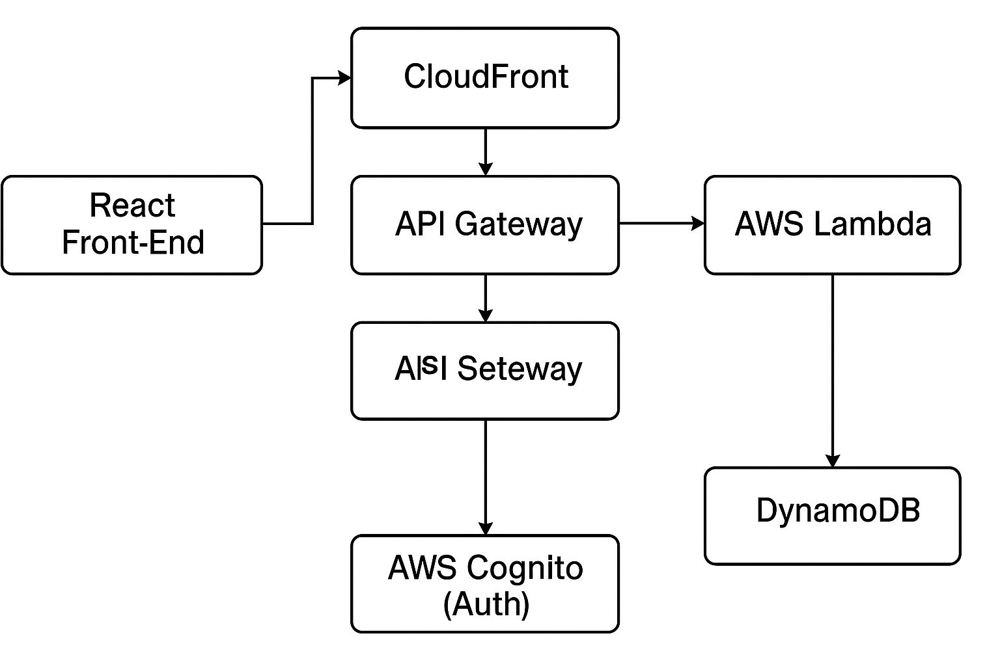

<h1 align="center">☁️ Cloud-Based Serverless Web Application</h1>

  
  
  

---

## 📑 Table of Contents

- [📝 Project Overview](#project-overview)
- [🎯 Objectives](#objectives)
- [🚀 Key Features](#key-features)
- [🏗️ System Architecture](#system-architecture)
- [🧰 AWS Services Used](#aws-services-used)
- [🔁 CI/CD Strategy](#cicd-strategy)
- [📄 Project Deliverable](#project-deliverable)
- [🎓 Academic Context](#academic-context)
- [📬 Contact](#contact)

---

## 📝 Project Overview

This is a **research-based cloud architecture proposal** for a modern, serverless web application leveraging Amazon Web Services (AWS).  
Designed as part of a graduate-level cloud computing course, the project focuses on scalability, low maintenance, high availability, and cost-efficiency using AWS-native services.

📄 **Note:** This repository contains a documented system design — no source code or implementation.

---

## 🎯 Objectives

- Architect a cloud-native web application using serverless principles
- Minimize operational overhead through managed services
- Ensure modularity, security, and scalability
- Document a deployment-ready blueprint for real-world use cases

---

## 🚀 Key Features

- ⚙️ **Serverless Architecture** — Using AWS Lambda for backend compute
- 🌐 **Static Front-End** — ReactJS hosted on S3 + CloudFront
- 🔐 **Secure Auth System** — AWS Cognito for sign-up, login, and access control
- 📦 **NoSQL Data Layer** — DynamoDB for fast, schema-less data storage
- 🔄 **Fully Automated CI/CD** — Deployment workflow with AWS CodePipeline

---

## 🏗️ System Architecture

Below is the high-level architecture diagram for the proposed cloud-based serverless application:

  

> Architecture is designed for high performance, resilience, and minimal operational cost.

---

## 🧰 AWS Services Used

| Service        | Purpose                                       |
|----------------|-----------------------------------------------|
| **S3**         | Static hosting for front-end                  |
| **CloudFront** | CDN to serve the app globally with caching    |
| **API Gateway**| Entry point for HTTP API calls                |
| **Lambda**     | Stateless backend logic processing            |
| **DynamoDB**   | Fast, scalable NoSQL database                 |
| **Cognito**    | User authentication and session management    |
| **CodePipeline** | Continuous integration & deployment (CI/CD) |

---

## 🔁 CI/CD Strategy

A deployment pipeline was proposed using **AWS CodePipeline** and **CodeBuild** to enable:

- Automated builds from version-controlled source (e.g., GitHub)
- Testing and linting of codebase
- Seamless deployment to S3, Lambda, and other AWS components
- Reduced manual intervention, higher delivery speed

---

## 📄 Project Deliverable

📎 [**CloudBasedApplication.pdf**](./serverless.pdf)

**Contents include:**
- Technical background
- Architecture description
- AWS service mapping
- Security and auth flow
- CI/CD plan
- Literature review with academic references

---

## 🎓 Academic Context

- **Course:** Cloud Computing (UnderGraduate Level)  
- **Institution:** Lakehead University  
- **Duration:** Dec 2023 – Apr 2024  
- **Instructor:** Dr. Md Moniruzzaman

---

## 📬 Contact

**Abhinav Mishra**  
[LinkedIn](https://www.linkedin.com/in/abhinav-mishra-4b72b120b/)  
[GitHub](https://github.com/Abhi12002)

---

> ⭐ If this helped you understand modern cloud architecture, feel free to star the repo and share feedback
